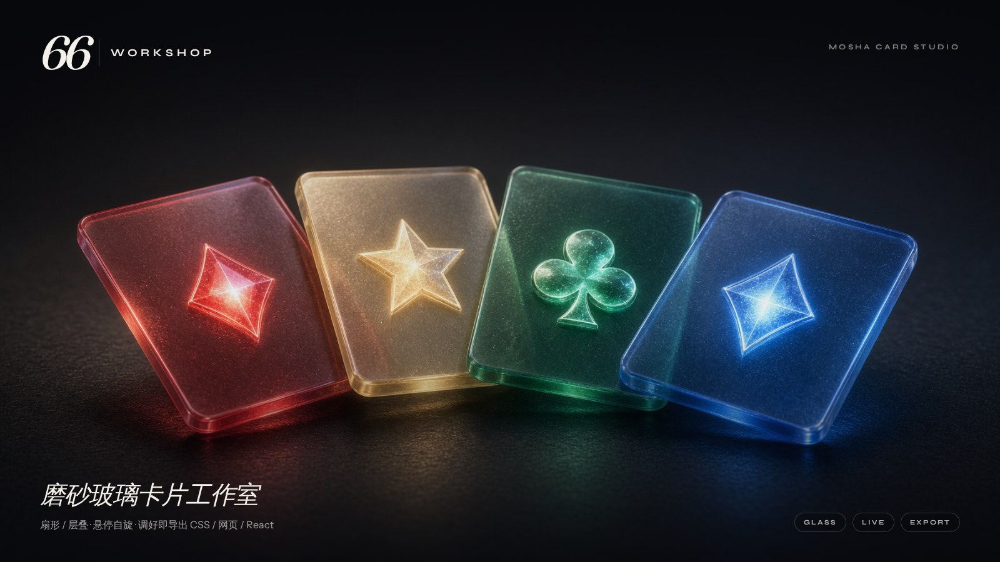
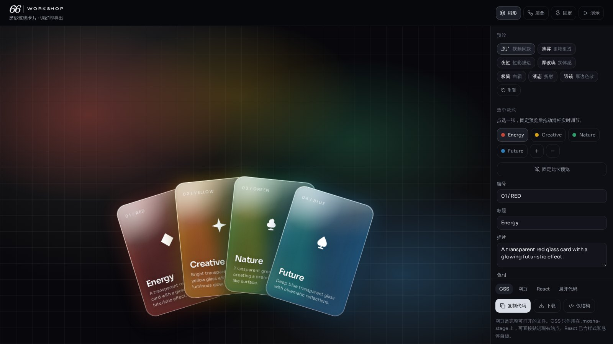
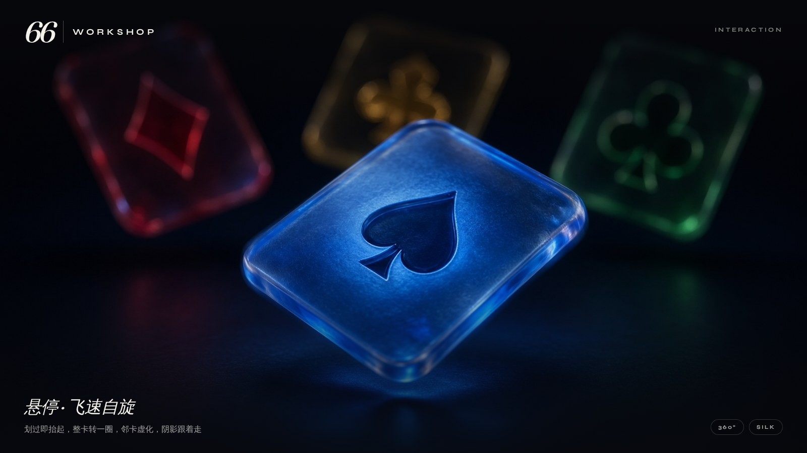
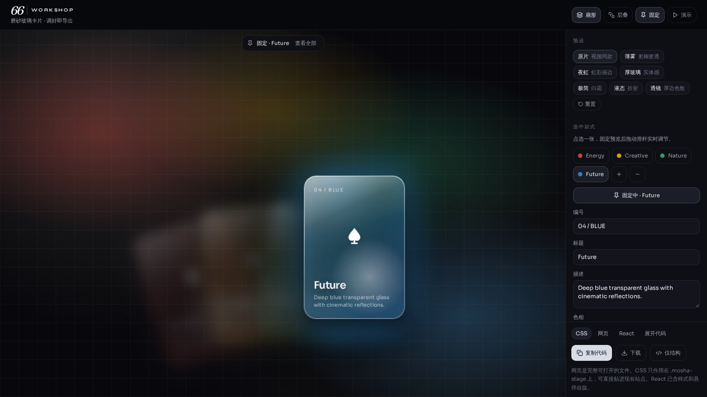
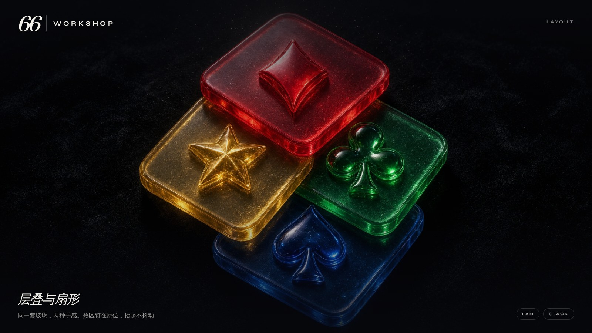
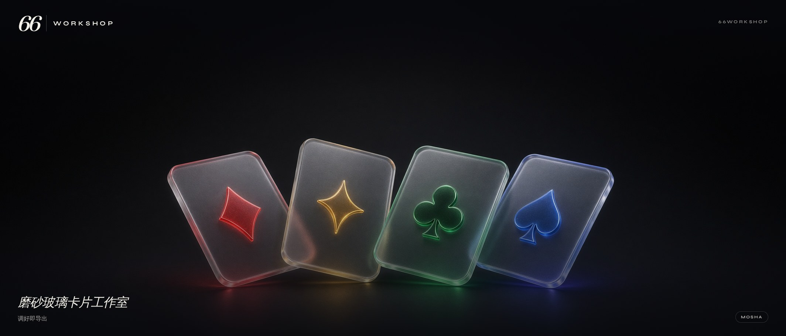
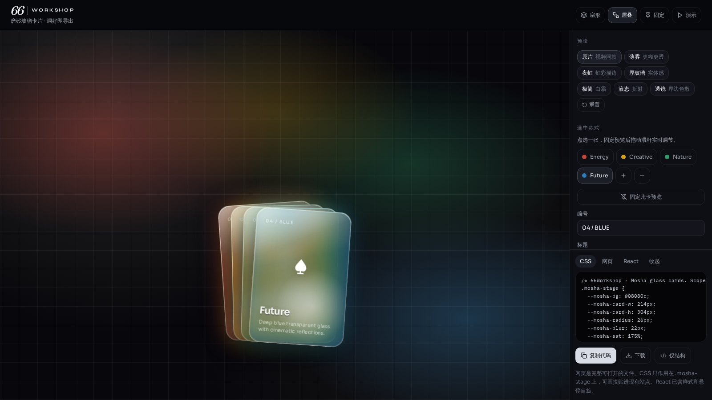

<p align="center">
  
</p>

<h1 align="center">66Workshop · Mosha</h1>

<p align="center">
  <strong>磨砂玻璃卡片工作室</strong><br />
  扇形 / 层叠 · 悬停自旋 · 调好即导出 CSS / 网页 / React
</p>

<p align="center">
  <a href="./demo/66workshop-operate-15s.mp4">▶ 15 秒操作录屏</a>
  ·
  <a href="./index.html">打开演示</a>
  ·
  <a href="./css/mosha-card.css">丢进项目的 CSS</a>
</p>

---

一副半透明扑克。红钻、金星、绿梅、蓝黑桃。玻璃厚度、色散、折射、扇形弧度、抬起和自旋，全部能在工作台里实时拧。调到满意，复制一段就能用。

## 工作台

左侧是卡片，右侧是参数。点一张可以钉住，对着它慢慢打磨；划过会在原位抬起，整卡转一圈，邻卡虚化，阴影跟着走。热区钉在扇形几何上，抬起不会把鼠标抖掉。

<p align="center">
  
</p>

## 三种手感

| 悬停自旋 | 固定调参 | 扇形 / 层叠 |
| :---: | :---: | :---: |
|  |  |  |
| 划过即抬起，整卡 360° 翻转 | 钉住一张，玻璃和光学实时变 | 同一套配方，两种排布 |

宽幅封面：

<p align="center">
  
</p>

## 导出

工作台底部直接出三种成品。CSS 只作用在 `.mosha-stage` 上，可贴进现有站点；网页是完整可打开的单页（含悬停自旋）；React 是带样式和交互的 `MoshaHand`。

<p align="center">
  
</p>

| 格式 | 用途 |
| --- | --- |
| **CSS** | 作用域在 `.mosha-stage`，丢进任何前端 |
| **网页** | 完整单页，打开即有悬停自旋 |
| **React** | 含样式 + 热区交互的组件 |

仓库里已经放好一份可直接打开的成品：

- [`index.html`](./index.html)
- [`css/mosha-card.css`](./css/mosha-card.css)

```html
<link rel="stylesheet" href="css/mosha-card.css" />
<!-- 把导出的 HTML 结构贴进来，或直接打开 index.html -->
```

`data-layout="fan"` 扇形，`data-layout="stack"` 层叠。

## 工作室源码

完整可调工作台（预览 + 滑杆 + 预设 + 导出）：

```bash
npm install
npm run dev
```

预设：**原片 / 液态 / 厚玻璃 / 薄镜 / 单色**。背景色、透明度、折射、色散都可以拧。状态会记在浏览器里，刷新不丢。

## 可调变量

在 `.mosha-stage` 上覆盖：

| 变量 | 作用 |
| --- | --- |
| `--mosha-blur` | 毛玻璃模糊 |
| `--mosha-sat` | 饱和 |
| `--mosha-fill` | 色淀 |
| `--mosha-opacity` | 卡片透明度 |
| `--mosha-refract` | 折射（模糊宜低） |
| `--mosha-chroma` | 色散描边 |
| `--mosha-spread` / `--mosha-gap` / `--mosha-arc` | 扇形 |
| `--mosha-duration` / `--mosha-spin` | 抬起时长 / 自旋 |
| `--mosha-lift` / `--mosha-scale` | 悬停抬升 / 放大 |
| `--mosha-sib-blur` / `--mosha-sib-op` | 邻卡虚化 |

每张卡片自己的色相：

```html
<article class="mosha-card" style="--tint:#2f7eb8; --i:1.5">
```

`--i` 是相对中心的序号。4 张卡用 `-1.5 -0.5 0.5 1.5`。

## 背景

玻璃需要后面有东西才能透。用深色底，`.mosha-ambient` 会铺一层与卡片同色的光斑。祖先元素不要加 `filter` / `backdrop-filter`。

## 封面

| 文件 | 用途 |
| --- | --- |
| [`docs/covers/hero.jpg`](./docs/covers/hero.jpg) | 主视觉 16:9 |
| [`docs/covers/banner.jpg`](./docs/covers/banner.jpg) | 超宽 21:9 |
| [`docs/covers/hover.jpg`](./docs/covers/hover.jpg) | 悬停自旋 |
| [`docs/covers/stack.jpg`](./docs/covers/stack.jpg) | 层叠静物 |
| [`docs/covers/workbench.jpg`](./docs/covers/workbench.jpg) | 工作台氛围 |
| [`docs/covers/studio-*.jpg`](./docs/covers) | 真实界面截图 |

MIT
